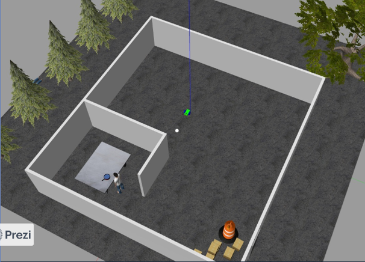

# Ball-Chaser-ROS
Using the Robotics Operating system (ROS) capability and gazebo platform to construct a basic ball tracking vehicle.To hunt down the ball, this bot employed a camera to capture frames and do image processing using open cv.The ball's characteristics, such as color, shape, and size, can be employed. Our goal was to create a rudimentary prototype for a bot that can detect and follow color.

# Sample Image of gazebo world

